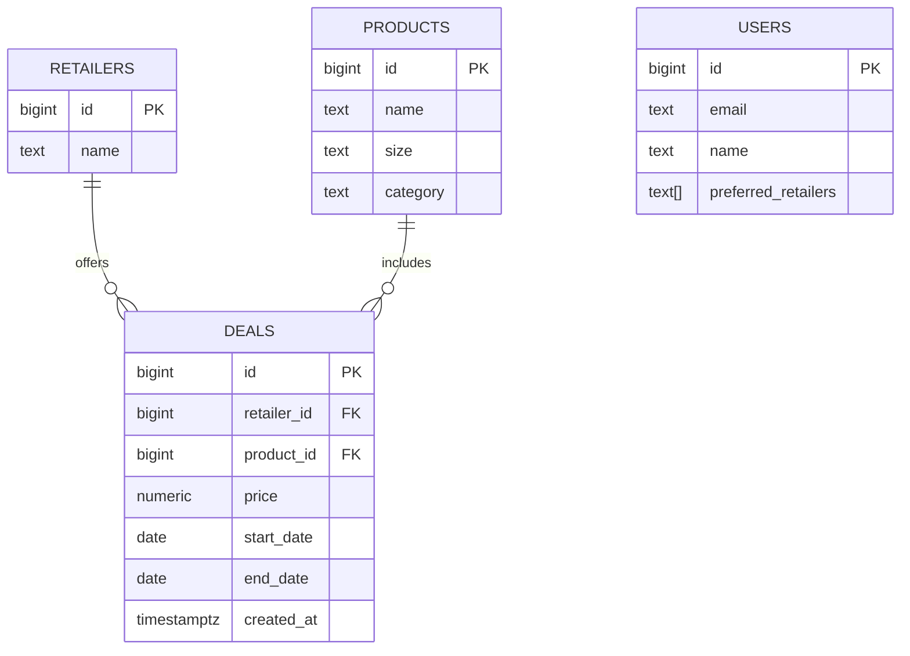

# Backend/Data Focus - "Deals → Email" Automation

TypeScript/Node pipeline that automates turning weekly deals into branded emails. Imports JSON or scraped data, stores in Supabase, applies user preferences, and sends HTML + plain-text emails with unit pricing. Includes a preview page and a single CLI command.

---

## Prerequisites

* Node.js 20+
* Supabase project (free tier is fine)
* Mailtrap account (SMTP) or a Resend API key (optional)

---

## Environment Variables

Create a `.env` from `.env.example` and fill:

```ini
# Supabase (DB)
SUPABASE_URL=...                   # Project URL
SUPABASE_SERVICE_ROLE_KEY=...      # Service role key (not anon)

# Email (choose ONE path)

# SMTP (recommended for development with Mailtrap)
SMTP_HOST=smtp.mailtrap.io
SMTP_PORT=2525
SMTP_USER=...
SMTP_PASS=...
```

---

## Schema Diagram (Mermaid)



> Apply the schema by opening **Supabase → SQL Editor** and running the contents of `sql/schema.sql` in this repo.

---

## Quick Start

1. **Install**

   ```bash
   npm install
   npm run build
   ```

2. **Configure Supabase & Email**

   * Copy `.env.example` to `.env` and fill values (see **Environment Variables** above).
   * In Supabase, run `sql/schema.sql` once.

3. **Run the end-to-end CLI (sample data)**

   ```bash
   npm run send:weekly
   ```

   This ingests `src/data/deals.sample.json`, filters by each user’s preferred retailers from `src/data/users.sample.json`, selects the top 6 deals by lowest price, renders branded HTML + plain-text, and sends via SMTP (or writes previews if SMTP is not set).

4. **Preview page**

   ```bash
   npm run preview:build
   open dist/site/index.html
   ```

5. **Stretch demo**

   ```bash
   npm run scrape:sprouts -- src/scrape/samples/sprouts.sample.html
   npm run send:weekly:scraped
   ```

---

## What I’d Build Next (2 more days)

* **Live retailer scraper** (Playwright or JSON endpoints) with store selection and robust date parsing.
* **Lightweight dashboard** to browse/search deals, tweak copy, and send a test email.
* **Scheduling** (GitHub Actions or a small cron worker) to send every Monday 8am CT.
* **Preferences UI** so users can manage `preferred_retailers` (linked from the email footer).
